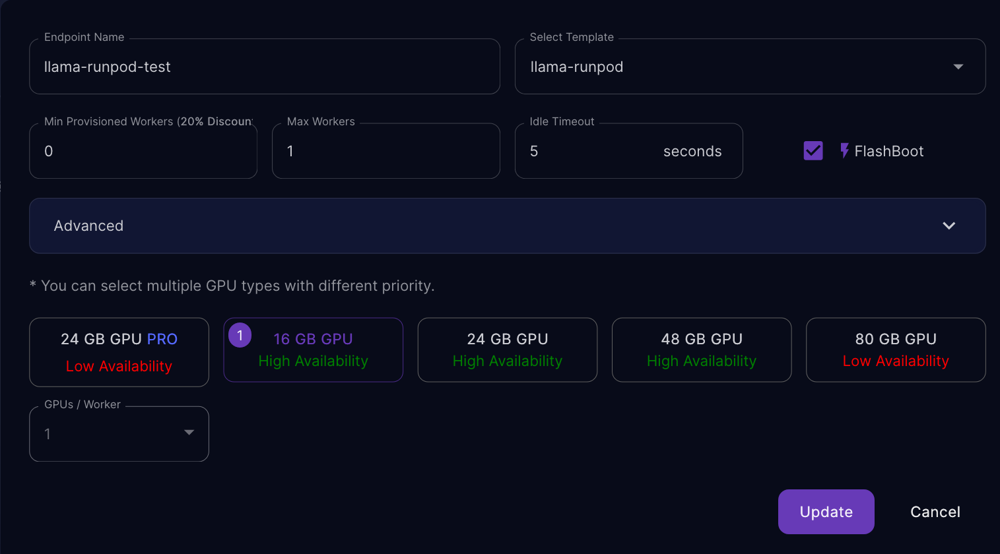

# Run llama.cpp on [RunPod](https://www.runpod.io/serverless-gpu)


## Description

RunPod provides a cheap serverless GPU service that allows to simply serve AI models. They handle queuing and auto-scaling.

You just have to provide a Docker image. This repository contains instructions to build your own image for any model.

## Steps

1. Clone this repository
2. Choose a model and download it to the `workspace` directory. Here we use [this model](https://huggingface.co/TheBloke/WizardLM-1.0-Uncensored-Llama2-13B-GGML) with 13B parameters.

```
wget -P workspace https://huggingface.co/TheBloke/WizardLM-1.0-Uncensored-Llama2-13B-GGML/resolve/main/wizardlm-1.0-uncensored-llama2-13b.ggmlv3.q4_K_M.bin
```

3. Build the Docker image. Create a `llama-runpod` repository on [Docker Hub](https://hub.docker.com/) and replace `your-docker-hub-login` with your login.

```
docker build -t llama-runpod .
docker tag llama-runpod your-docker-hub-login/llama-runpod:latest
docker push your-docker-hub-login/llama-runpod:latest
```

4. Go to RunPod's serverless [console](https://www.runpod.io/console/serverless) and create a template:


You can pass the arguments to `llama_cpp` in the `LLAMA_ARGS` environment variable. Here are mine:

```
{"model_path": "wizardlm-1.0-uncensored-llama2-13b.ggmlv3.q4_K_M.bin", "n_gpu_layers": -1}
```

`n_gpu_layers` is set to -1 to offload all layers to the GPU.

5. Create the endpoint:



6. Profit!


Replace `ENDPOINT_ID` and `API_KEY` with your own values. You can get `API_KEY` on [that page](https://www.runpod.io/console/serverless/user/settings).


```python
import requests

url = "https://api.runpod.ai/v2/ENDPOINT_ID"
headers = {"Authorization": "API_KEY"}


payload = {"input": {"prompt": "Me: Hello, what is your purpose?\nAI:"}}

# sync (blocking)
r = requests.post(url + "/runsync", json=payload, headers=headers)
r.json()

# async (non-blocking)
r = requests.post(url + "/run", json=payload, headers=headers)
id_ = r.json()["id"]

# get async result
r = requests.get(url + f"/status/{id_}", headers=headers)
r.json()
```

You can pass the keyword arguments to LLaMa in the payload. See the llama_cpp [docs](https://llama-cpp-python.readthedocs.io/en/latest/api-reference/#llama_cpp.Llama.__call__) for other arguments.

## Additional details and tips

- clean Docker after a build or if you get into trouble: `docker system prune -a``
- debug your Docker image with `docker run -it llama-runpod`
- we froze `llama-cpp-python==0.1.78` in `Dockerfile` because the model format changed from `ggmlv3` to `gguf` in version `0.1.79` but the conversion script in [llama.cpp](https://github.com/ggerganov/llama.cpp) is not fully working
- you can test `handle.py` locally with `python handle.py`